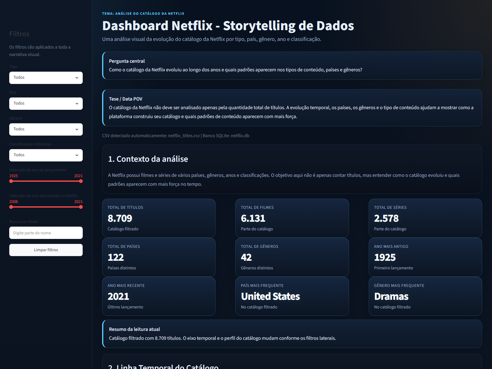

# Dashboard Netflix - Storytelling de Dados

Projeto em Python com interface web local via Streamlit para analisar o catálogo da Netflix com foco em storytelling de dados.

## Links do projeto

- **GitHub:** <https://github.com/Bruno-Gadelha25/dashboard-netflix-storytelling>
- **Vercel:** <https://dashboard-netflix-python.vercel.app>
- **Vitrine estática:** `vercel-static/index.html`

## Tema

Análise do catálogo da Netflix.

## Contexto

A Netflix possui filmes e séries de vários países, gêneros, anos e classificações. O objetivo do projeto é entender como o catálogo evoluiu ao longo do tempo e quais padrões aparecem nos dados.

## Pergunta principal

Como o catálogo da Netflix evoluiu ao longo dos anos e quais tipos de conteúdo dominam a plataforma?

## Tese / Data POV

O catálogo da Netflix não deve ser analisado apenas pela quantidade total de títulos. A evolução temporal, os países, os gêneros e o tipo de conteúdo ajudam a mostrar como a plataforma construiu seu catálogo e quais padrões de conteúdo aparecem com mais força.

## Bibliotecas usadas

- `pandas`
- `streamlit`
- `plotly`
- `sqlite3` e `pathlib` como bibliotecas padrão do Python

O arquivo `requirements.txt` contém apenas as dependências externas:

- `pandas`
- `streamlit`
- `plotly`

## Como rodar o projeto

1. Abra um terminal na pasta do projeto.
2. Instale as dependências:

```bash
pip install -r requirements.txt
```

3. Execute o dashboard:

```bash
streamlit run app.py
```

4. Abra no navegador:

```txt
http://localhost:8501
```

Se a porta `8501` estiver ocupada, rode:

```bash
streamlit run app.py --server.port 8502
```

Nesse caso, abra:

```txt
http://localhost:8502
```

Se o comando `python` apontar para outro executável no seu Windows, use o atalho `abrir_dashboard.bat` ou o comando `py -3.13 -m streamlit run app.py`. O atalho tenta `8501` e troca para `8502` se a porta já estiver ocupada.

O aplicativo detecta automaticamente o CSV compatível com o esquema da Netflix na pasta do projeto.

## Estrutura principal

- `app.py`: dashboard principal e navegável no localhost.
- `netflix_titles.csv`: dataset original da Netflix.
- `netflix.db`: banco SQLite gerado/validado a partir do CSV.
- `vercel-static/`: vitrine estática com capturas, usada apenas como apresentação.

## Como fazer deploy

O projeto principal roda em Streamlit, então a publicação em Vercel foi feita por meio de uma vitrine estática dentro da pasta `vercel-static`.

Fluxo usado no deploy:

1. Gerar a vitrine estática com `index.html` e capturas do dashboard.
2. Entrar na pasta `vercel-static`.
3. Executar:

```bash
vercel
vercel --prod
```

## Como o banco SQLite foi criado

Na inicialização do aplicativo, o script:

- localiza automaticamente o CSV da Netflix;
- padroniza os nomes das colunas;
- remove duplicados;
- trata valores vazios com `Desconhecido` quando faz sentido;
- converte `date_added` para data;
- cria as colunas derivadas `year_added`, `month_added`, `main_country`, `decade`, `content_age` e `main_genre`;
- grava os dados no banco `netflix.db`.

As tabelas criadas são:

- `titulos`
- `generos`
- `paises`
- `diretores`
- `elenco`
- `classificacoes`
- `linha_temporal`

## Estrutura narrativa do dashboard

O dashboard foi organizado como uma história de dados:

1. **Contexto da análise**
2. **Pergunta central**
3. **Tese / Data POV**
4. **Linha Temporal do Catálogo**
5. **Perfil do catálogo**
6. **Análise de duração**
7. **Relações entre variáveis**
8. **Tabela interativa**
9. **Conclusão da análise**

## Prints

Espaço para registrar imagens do projeto apresentado. O print principal do dashboard fica em `assets/dashboard-home.png`:



Se quiser adicionar mais imagens, você pode incluir no diretório `assets/`:

- Captura da linha temporal do catálogo.
- Captura dos filtros laterais.
- Captura da tabela interativa.
- Captura da vitrine na Vercel.

## Justificativa dos gráficos

- **Linha por ano de lançamento**: mostra a evolução do catálogo ao longo do tempo.
- **Linha por ano de entrada na Netflix**: revela quando a plataforma adicionou mais conteúdo.
- **Linha comparativa filmes x séries**: permite comparar a evolução dos dois tipos de conteúdo.
- **Barras por década**: mostra se o catálogo está concentrado em produções mais recentes ou antigas.
- **Pizza/rosca de filmes x séries**: evidencia a composição geral do catálogo.
- **Barras horizontais de países**: mostra a origem geográfica dos títulos.
- **Barras horizontais de gêneros**: evidencia os temas mais recorrentes.
- **Barras de classificação indicativa**: mostra o perfil etário predominante.
- **Histograma de duração dos filmes**: identifica concentração de filmes curtos ou longos.
- **Barras de temporadas das séries**: mostra a distribuição do tamanho das séries.
- **Dispersão ano x duração**: ajuda a visualizar possíveis relações entre lançamento e duração dos filmes.

## Explicação da linha temporal

A linha temporal permite enxergar:

- a concentração de lançamentos em determinados anos;
- os anos de maior crescimento do catálogo;
- a diferença entre o ritmo de inclusão de filmes e séries;
- a concentração do catálogo em décadas específicas.

## Explicação do gráfico de dispersão

O gráfico de dispersão ajuda a visualizar possíveis relações entre ano de lançamento e duração dos filmes. Ele é útil para observar se títulos mais antigos tendem a ser mais longos, mais curtos ou se não existe um padrão claro.

## Como usar os filtros

O painel lateral permite filtrar:

- tipo de conteúdo;
- país;
- gênero;
- classificação indicativa;
- intervalo de ano de lançamento;
- intervalo de ano adicionado na Netflix;
- busca por título.

Os filtros atualizam todos os gráficos, a tabela e a conclusão automática.

## Conclusão esperada

A análise deve mostrar, de forma visual e narrativa:

- qual tipo de conteúdo domina o catálogo;
- quais países aparecem com mais frequência;
- quais gêneros se destacam;
- em quais anos houve maior crescimento;
- quais décadas concentram mais títulos;
- como filmes e séries se comportam ao longo do tempo.

## Observação

O projeto foi pensado para não quebrar com valores vazios. Campos sem informação são tratados como `Desconhecido` quando necessário, e os gráficos exibem mensagens amigáveis quando os filtros deixam a seleção sem dados.
